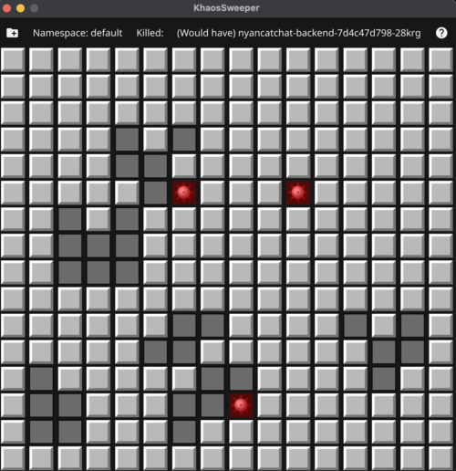

# KhaosSweeper


<br/>

You've heard of [Chaos Monkey](https://netflix.github.io/chaosmonkey/), you've heard of [Kube DOOM](https://github.com/storax/kubedoom), now get ready for KhaosSweeper!
A minesweeper game that randomly kills pods in your Kubernetes cluster, when a mine is hit, because why not?

Built using Go, FyneV2 and k8s.io/client-go. KhaosSweeper is a simple minesweeper clone that randomly kills pods in your Kubernetes cluster when a mine is hit. It's a fun way to test your cluster's resilience to failures.

*Disclaimer: This minesweeper clone is rigged. It does not follow the rules of the original game. There is no way to win. You will lose. You will lose pods. You will lose pods randomly. You will lose pods randomly and often. You will lose pods randomly and often and there is nothing you can do about it. You have been warned.*

## Installation via Homebrew (MacOS/Linux - x86_64/arm64)
```
brew install stenstromen/tap/khaossweeper
```

## Download and Run Binary
* For **MacOS** and **Linux**: Checkout and download the latest binary from [Releases page](https://github.com/Stenstromen/khaossweeper/releases/latest/)
* For **Windows**: Build the binary yourself.

## Build and Run Binary

See [Build](build.md) docs on how to build binary

```bash
./khaossweeper
```

## Example Usage
```bash
Usage:
  khaossweeper [flags]

Flags:
  -h, --help                help for khaossweeper
  -k, --kubeconfig string   Kubeconfig file (default "$HOME/.kube/config")
  -n, --namespace string    A name to say hello to. (default "default")
  -s, --safe-mode           Show what pod would have been deleted, but don't actually delete it
```

## Screenshots
